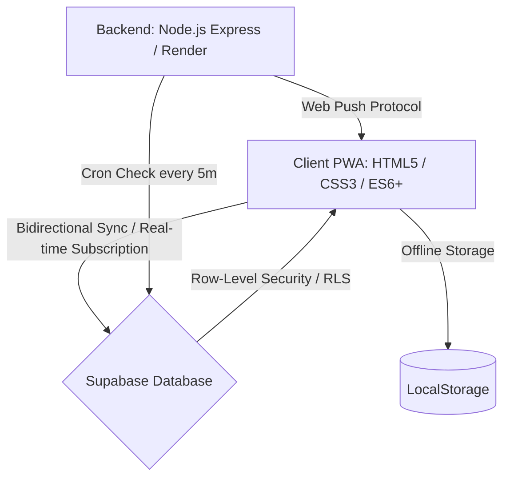

# LifeCycle 🧼🧔👁️🚗

> **A premium, offline-first Progressive Web App (PWA) designed for unified tracking of daily habits, personal care cycles, health controls, vehicle maintenance, and financial projects.**

LifeCycle is a showcase of full-stack architecture built to optimize personal workflows, replacing notification fatigue and easily ignored calendar reminders with an adaptive, color-coded visual dashboard and a centralized, floating **Notifications Center** with background push alerts.

---

## 🛠️ Architecture & Technology Stack

*   **Frontend Client:** HTML5, Vanilla CSS3 (custom glassmorphism style, dark-mode first design), and ES6+ JavaScript.
*   **Data Persistence:** Offline-first architecture utilizing `LocalStorage` with custom bidirectional cloud sync.
*   **Database Cloud Sync:** Real-time database subscription and synchronization with **Supabase**, featuring automatic conflict resolution and client-side merge.
*   **Backend Notification Server:** Node.js Express server hosted on **Render**, performing periodic database checks and dispatching secure Web Push Notifications.
*   **PWA Features:** Service Workers with a **Network-First** caching strategy for instant online updates and offline capability, along with a standard web app manifest.

---

## 🔒 Security & Data Integrity Best Practices

*   **Zero Credentials Exposed:** All sensitive data (database connection strings, service role keys, VAPID private keys) are stored as encrypted environment variables in Render and never checked into the code.
*   **Row-Level Security (RLS):** Supabase database tables enforce strict RLS policies ensuring that users can only read and write their own data, even when utilizing public anon keys.
*   **Database-Level Constraints:** Implemented custom check constraints (`check_no_object_string`) at the Postgres level to reject malformed serialization attempts, safeguarding data integrity.
*   **Safe Client Parsing:** The application features robust local storage parsers with isolated try/catch boundaries, ensuring that parsing anomalies in one module never disrupt the main application loop.

---

## 🚀 Key Modules

### 1. 🧼 Hygiene & Textile Tracker
Monitor time elapsed since washing or changing key home textiles (African sponges, hand towels, body towels, bed sheets, pillowcases) and schedule robotic vacuum cleaner warnings.

### 2. 🧔 Grooming & Care
Custom counters for personal care logs (beard shaves, haircuts, axillary grooming) with a predictive algorithm estimating the next optimal beard shave day based on average historical frequency.

### 3. 👁️ Contact Lenses Manager
Real-time day counters for contact lenses wear time, solutions, lens cases, Systane drops, and microfiber cloth usage, with automated low-stock safety threshold warnings.

### 4. 🚗 Vehicle Maintenance Log
Smart odometer tracking flagging services for oil changes, alignment, tire rotations, and replacements, shifting colors (green/yellow/red) based on km or days remaining.

### 5. 💼 Financial Projects (ProjectPulse)
Track active contracts in USD, manage Workana subscriptions, and display visual deadline warnings as the subscription renewal approaches.

### 6. 🩺 Health & Medicine (Salud)
Track annual/periodical visits for Dentists, Ophthalmologists, Clinical Blood Tests, and generic custom health controls.

### 7. 🔔 Centralized Notifications Panel
Float notification center displaying overdue items across all sections, permitting immediate checklist completion (`✓ Listo`) from any screen. Supports custom background push notification schedules.
