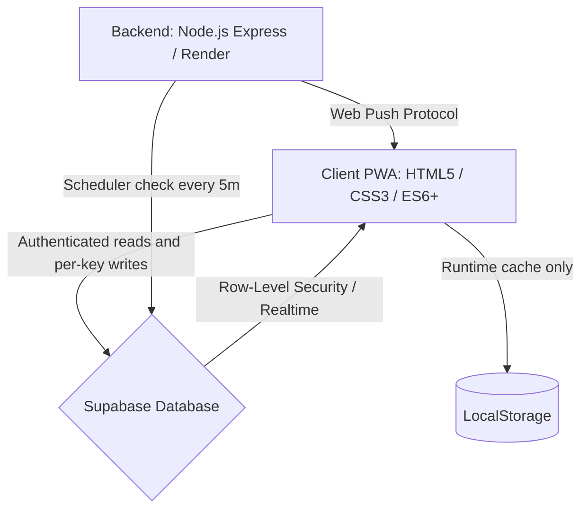

# LifeCycle 🧼🧔👁️🚗

> **A private, cloud-first Progressive Web App (PWA) designed for unified tracking of daily habits, personal care cycles, health controls, vehicle maintenance, tasks, and financial projects.**

LifeCycle is a showcase of full-stack architecture built to optimize personal workflows, replacing notification fatigue and easily ignored calendar reminders with an adaptive, color-coded visual dashboard and a centralized, floating **Notifications Center** with background push alerts.

---

## 🛠️ Architecture & Technology Stack


```mermaid
graph TD
    Client[Client PWA: HTML5 / CSS3 / ES6+] -->|Authenticated reads and per-key writes| Supabase{Supabase Database}
    Supabase -->|Row-Level Security / Realtime| Client
    Client -->|Runtime cache only| LS[(LocalStorage)]
    Server[Backend: Node.js Express / Render] -->|Scheduler check every 5m| Supabase
    Server -->|Web Push Protocol| Client
```

*   **Frontend Client:** HTML5, Vanilla CSS3 (custom glassmorphism style, dark-mode first design), ES6+ JavaScript, and a pinned local copy of SortableJS for accessible mouse/touch card ordering.
*   **Data Persistence:** Cloud-first architecture with **Supabase** as the source of truth. `LocalStorage` is only a runtime cache and is cleared when the session closes.
*   **Database Cloud Sync:** Authenticated per-key updates avoid replacing unrelated module data, while Realtime and foreground refreshes keep devices aligned.
*   **Backend Notification Server:** Node.js Express server hosted on **Render**, performing periodic database checks and dispatching secure Web Push Notifications.
*   **PWA Features:** Installable manifest and a Service Worker dedicated to Push notifications. The application intentionally requires connectivity and does not cache application data for offline use.

---

## 🔒 Security & Data Integrity Best Practices

*   **Zero Credentials Exposed:** All sensitive data (database connection strings, service role keys, VAPID private keys) are stored as encrypted environment variables in Render and never checked into the code.
*   **Row-Level Security (RLS):** Supabase database tables enforce strict RLS policies ensuring that users can only read and write their own data, even when utilizing public anon keys.
*   **Private Medical Attachments:** Blood-test files are stored in a private Supabase bucket, restricted to the authenticated user's folder and opened through short-lived signed URLs.
*   **Database-Level Constraints:** Implemented custom check constraints (`check_no_object_string`) at the Postgres level to reject malformed serialization attempts, safeguarding data integrity.
*   **Safe Client Parsing:** The application features robust cache parsers with isolated try/catch boundaries, ensuring that parsing anomalies in one module never disrupt the main application loop.

---

## 🚀 Key Modules

### 1. 🧼 Hygiene & Textile Tracker
Monitor time elapsed since washing or changing key home textiles (African sponges, hand towels, body towels, bed sheets, pillowcases) and schedule robotic vacuum cleaner warnings.

### 2. 🧔 Grooming & Care
Custom counters for personal care logs (beard shaves, haircuts, axillary grooming) with a predictive algorithm estimating the next optimal beard shave day based on average historical frequency.

### 3. 👁️ Contact Lenses Manager
Real-time day counters for contact lenses wear time, solutions, lens cases, Systane drops, and microfiber cloth usage, with automated low-stock safety threshold warnings.

### 4. 🚗 Vehicle Maintenance Log
Track odometer-based maintenance, periodic checks, and document expirations through a configurable catalog. Existing personal records migrate in place, while a fresh account can create only the vehicle cards it actually needs.

### 5. 💼 Financial Projects (ProjectPulse)
Track active contracts in USD, manage Workana subscriptions, and display visual deadline warnings as the subscription renewal approaches. Reusable project templates can prefill delivery time, fee, source, plan, and fresh pending tasks without copying a client or any dates.

### 6. 🩺 Health & Medicine (Salud)
Track annual/periodical visits for Dentists, Ophthalmologists, Clinical Blood Tests, and generic custom health controls.

### 7. 🔔 Centralized Notifications Panel
Float notification center displaying overdue items across all sections, permitting immediate checklist completion (`✓ Listo`) from any screen. Background Push includes per-device registration, rename/revocation, targeted tests, engine health, expired-endpoint cleanup, and a private delivery-attempt history that distinguishes provider acceptance from actual user visibility.

### 8. ⚙️ Unified Configurable Trackers
Every recurring card in Hygiene, Care, Lenses, and Health uses the same versioned model and is managed from **Profile → Cards**. Existing personal cards are migrated in place with their histories, thresholds, alert settings, and specialized behavior preserved; a fresh account starts with no predefined cards. The centralized manager supports create, edit, reorder, archive, restore, and protected permanent deletion. Each runtime card supports a user-defined action, a daily or monthly cadence that restarts only after a recorded action, automatic visual states, optional instructions, history correction, an optional daily backend Push alert while overdue, and a multi-select mode for recording several completed cards at once. Specialized timers, inventory, and medical attachments remain owned by their dedicated modules.

### 9. 🧭 Personalized Navigation
The **Profile → Modules** screen can hide or restore any main module without deleting its information or notifications. At least one module always remains visible, and navigation automatically falls back to an available module when the previous selection is hidden. Desktop uses a collapsible sidebar, tablets use a compact icon rail, and mobile uses four synchronized favorites plus a **More** sheet; favorites can be changed without modifying the modules themselves.

### 10. 📅 Daily Focus & Quick Tasks
The **Today** view groups urgent tasks, project deadlines, and overdue trackers without copying their data. Items can be opened in their source module or completed directly when the underlying workflow supports it. Its additional shortcuts are configurable from **Profile → Modules** and open the original Project, Finance, Gym, or Cards workflow instead of creating parallel data. Tasks can also be captured from any module, with **Urgent** as the default priority and non-urgent work kept as an explicit long-term option.

### 11. 🔁 Confirmable Financial Recurrence
Finance rules remember the usual type, category, amount, currency, cadence, and next due date. Due occurrences appear as review items and only become real income or expense records after the original form is confirmed. Each occurrence is idempotent, and rules can be edited, paused, resumed, or removed without deleting previously confirmed transactions.

### 12. ⚡ Command Palette & Keyboard Reference
The global search also acts as a command palette: it can locate cards, tasks, and projects or open the original creation flows for tasks, cards, reminders, income, and expenses. `Ctrl+K` / `Cmd+K` opens it, while the complete shortcut reference lives in **Profile → Preferences** and is rendered from the same registry used by the application.

### 13. ⏰ Configurable Recurring Reminders
Weekly Push reminders are managed from **Profile → Recordatorios** instead of being hardcoded. Each reminder controls its name, Push title, message, category, active days, time, and enabled state. Legacy personal reminders migrate into the versioned catalog, and the Render notification engine consumes that same synchronized catalog without requiring a database schema change.

---

## ✅ Verification

For local development, copy `.env.example` to `.env` and fill it with the values from the private Supabase/Render configuration. `.env` is ignored by Git; `SUPABASE_SERVICE_ROLE_KEY`, `VAPID_PRIVATE_KEY`, and `ADMIN_TOKEN` must remain backend-only.

```bash
npm ci
npm test
node --check server.js
```

The repository also runs these checks through GitHub Actions. Product findings are documented in [`docs/AUDITORIA_PRODUCTO_UX_2026-07-28.md`](docs/AUDITORIA_PRODUCTO_UX_2026-07-28.md), the mandatory interface rules are in [`docs/UX_CONVENTIONS.md`](docs/UX_CONVENTIONS.md), and deployment, Push, backup, Render, and Supabase verification steps are documented in [`docs/OPERACION_Y_VERIFICACION.md`](docs/OPERACION_Y_VERIFICACION.md).
